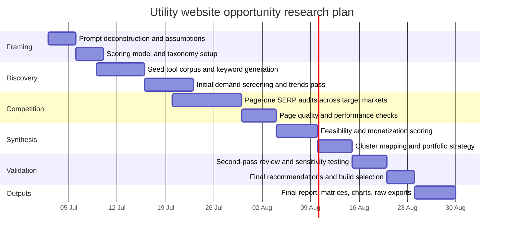

# Research Design Report for Utility Website Opportunity Research

## Executive Summary

The attached brief is not actually topic-free: it specifies a concrete industry research problem—identifying lightweight utility websites and web tools that can win organic search traffic, solve immediate user tasks, and monetize through ads, affiliate income, leads, or adjacent offers. It also makes the evaluation criteria unusually explicit: demand, keyword frequency, ranking difficulty, SERP weakness, monetization, feasibility, evergreen value, cluster expansion, and solo-founder suitability. fileciteturn0file0

Because the topic is now visible, the most rigorous way to proceed is **not** to invent a generic research subject, but to treat the prompt as a real market-opportunity study and design the research so it can be executed cleanly. The strongest interpretation is a **portfolio-opportunity assessment for SEO-driven utility tools, weighted toward defensible professional and operational niches** rather than only mass-market calculators and generators. That interpretation fits the prompt’s explicit focus on business, logistics, operations, safety, compliance, and productivity tools, while also reducing the classic trap of building “yet another generic converter” into a bloodbath of incumbents and ad clutter. fileciteturn0file0

The recommended research design is a staged mixed-method approach. Use Google Keyword Planner for keyword discovery and rough demand estimates; Google Trends for relative demand, seasonality, region splits, and emerging interest; manual SERP audits for actual competitive weakness; Search Console and GA4 later for post-launch validation; Ahrefs or a similar SEO platform for keyword difficulty, backlink context, and SERP composition; PageSpeed Insights and Core Web Vitals data for mobile and UX quality assessments. Google itself warns that search success depends on helpful, people-first content, sound page experience, and avoiding search-engine-first mass automation; AdSense also disallows low-value or ad-heavy pages. That means the research should prioritize **useful utilities plus supporting value-add content**, not mechanically expanded page farms. citeturn7view0turn7view4turn7view5turn12view0turn8view0turn8view2turn7view3turn15view0turn10view0

The key success condition is simple: the final research should identify one first-build opportunity where search intent is explicit, current results are visibly weak or underserving the task, the MVP is realistically buildable by a solo founder or very small team, monetization is policy-safe, and the tool can expand into a related topical cluster. If the work cannot show that full chain with evidence, the opportunity may be interesting, but it is not yet investment-grade. fileciteturn0file0

## Assumptions and Topic Framing

The prompt specifies the **core topic**, broad category scope, monetization framing, and expected outputs, but it still leaves several execution details open. The table below states those gaps explicitly rather than smuggling in assumptions dressed as facts. The underlying brief is a utility website opportunity study focused on evergreen, search-driven web tools. fileciteturn0file0

| Item | Status | What is specified | What remains unspecified | Working treatment in this report |
|---|---|---|---|---|
| Research topic | Specified | Utility website and web-tool opportunity research | None on topic substance | Proceed using the actual prompt topic |
| Scope | Partly specified | Ten tool categories, focus on search demand, SERP weakness, monetization, feasibility, cluster potential | Whether all categories must be treated equally | Weight broad scan, but prioritize defensible niches |
| Audience | Unspecified | Not named in the prompt | Founder, investor, operator, SEO team, or product team | Treat as a decision-maker choosing what to build next |
| Depth | Unspecified | Output expectations are extensive | Whether the user wants a design blueprint or full market execution immediately | Deliver a research design robust enough for execution |
| Timeline | Unspecified in the attachment | None | Research window and resourcing | Use the user-requested 6–8 week plan |
| Deliverables | Partly specified | The brief lists desired outputs for the eventual opportunity report | File formats, decision thresholds, and update cadence | Recommend report, matrices, charts, raw exports, and scoring workbook |

### Plausible interpretations

Three plausible interpretations fit the brief and common market-research patterns.

| Interpretation | Description | Strengths | Weaknesses |
|---|---|---|---|
| Broad consumer utility scan | Evaluate all utility categories evenly to find the best SEO-first consumer tool | Maximizes discovery and traffic upside | Risks surface-level analysis and overexposure to crowded SERPs |
| Defensible professional utility scan | Prioritize business, operations, logistics, safety, compliance, and productivity utilities | Better monetization quality, lower frivolous competition, stronger repeat-use potential | Lower raw search volume than consumer “toy” tools |
| Solo-founder execution scan | Bias toward fastest-build tools that can ship via AI/no-code in days, not weeks | Strong practical fit and fast iteration | Can overweight speed and underweight moat |

### Chosen interpretation

The best interpretation is **defensible professional utility scan with a secondary filter for solo-founder feasibility**. That choice is justified by the brief itself, which explicitly tells the researcher to pay special attention to business, logistics, operations, safety, compliance, supply chain, and productivity tools, and to prioritize opportunities suitable for a solo founder or very small team. In other words: not just traffic, but traffic with elbows. fileciteturn0file0

This interpretation is also more future-proof under Google’s current guidance. Google repeatedly emphasizes people-first, non-commodity content and warns against scaled page creation whose primary purpose is ranking manipulation; professional utilities are more likely to support unique workflows, first-party expertise, and genuine product value than generic search-churn pages built around every possible long-tail variant. citeturn8view0turn8view1turn8view2turn15view0turn16view0

## Research Design for the Chosen Interpretation

### Research questions

For the chosen interpretation, the research should answer the following questions:

1. Which professional or operational utility-tool queries show enough recurring search demand to justify a standalone or cluster-first website?
2. Which of those queries have page-one SERPs where user intent is only partially satisfied, or where ranking sites are slow, thin, outdated, ad-heavy, or structurally weak?
3. Which opportunities can be shipped as a credible MVP without regulated data handling, fragile scraping, or expensive proprietary inputs?
4. Which opportunities can monetize safely under AdSense and/or higher-quality monetization models such as templates, affiliate software referrals, lead capture, or B2B upsells?
5. Which opportunities have the strongest cluster economics—meaning one tool can expand into multiple adjacent tools, templates, glossaries, and workflow pages?
6. Which opportunities remain defensible if Google Search continues to rely on people-first relevance, page-level evaluation, and AI-assisted result presentation rather than exact-match keyword hacks? citeturn16view3turn15view0turn8view0turn7view3

### Objectives, variables, and success criteria

| Dimension | Definition |
|---|---|
| Primary objective | Rank and prioritize candidate utility sites that are feasible, search-relevant, monetizable, and defensible |
| Secondary objective | Identify one first-build opportunity and a small adjacent cluster |
| Unit of analysis | A tool-intent keyword or tightly related keyword cluster |
| Key demand variables | Monthly search volume, annualized demand, seasonality, geography, related-query spread |
| Key competition variables | Top-page domain mix, low-authority presences, intent match, UX quality, page speed, ad load, freshness, SERP stability |
| Key feasibility variables | MVP complexity, input/data requirements, API dependency, maintenance load, legal sensitivity, no-code/AI compatibility |
| Key monetization variables | Ad suitability, CPC proxy, affiliate fit, lead-gen fit, premium feature fit, B2B upsell fit |
| Key strategic variables | Evergreen demand, repeat use, internationalization, cluster size, differentiation potential |
| Minimum success threshold | At least one opportunity scores well across demand, SERP weakness, feasibility, and monetization without violating policy or entering a regulated niche |
| Strong success threshold | One first-build tool plus 5–15 adjacent pages/tools, with evidence of weak page-one results and realistic MVP build simplicity |

A practical scoring model should weight variables roughly in this order: **intent clarity and SERP weakness first, demand second, build simplicity third, monetization fourth**. That weighting reflects Google’s emphasis on helpful and relevant pages, the sampled nature of volume estimates, and the reality that solo-founder execution dies more often from complexity than from lack of spreadsheet optimism. citeturn16view3turn8view0turn7view5turn18academia0turn10view0

## Literature and Source Plan

### Prioritized source stack

A strong source plan must separate **data for discovery**, **data for validation**, **data for competition**, and **data for policy/risk**. If those all come from one SEO tool, the research will look tidy and still be wrong.

| Priority | Source type | Examples | Why it matters |
|---|---|---|---|
| Highest | Official Google sources | Google Keyword Planner, Google Trends, Search Console, Search Central, AdSense Help | Best for demand discovery, relative trend interpretation, policy, indexing, and Search behavior framing |
| High | Search-competition platforms | Ahrefs, Semrush, Similarweb, Moz, LowFruits | Useful for KD proxies, backlink context, traffic estimates, SERP composition, and domain strength |
| High | Direct SERP observation | Manual Google page-one reviews across target locales and device types | Only way to inspect real intent satisfaction, weak incumbents, UI quality, and ad clutter |
| Medium | Performance datasets and UX tools | PageSpeed Insights, Core Web Vitals, CrUX-backed diagnostics | Needed because poor UX can signal opportunity and also affect monetization and retention |
| Medium | Question and topic expansion tools | AlsoAsked, AnswerThePublic, autosuggest, related searches | Helpful for cluster planning, FAQ discovery, and long-tail expansion |
| Medium | Vertical primary sources | Official calculation/formula or standards bodies relevant to each niche | Essential for any calculator or compliance-style tool where accuracy matters |
| Medium | Academic and methods literature | Recent papers on search-intent ambiguity, query classification, Google Trends sampling, SERP behavior | Useful to avoid overtrusting noisy or sampled demand signals |

This prioritization is grounded in tool capabilities and limitations documented by Google and leading SEO platforms. Google Keyword Planner provides keyword discovery plus search and cost estimates; Google Trends is sampled, aggregated, and normalized, which makes it strong for directional trends and weak as a standalone absolute-volume source; Search Console supplies query-, page-, and country-level impressions and clicks once a site exists; Ahrefs’ KD is explicitly based on referring domains in the top 10 and should therefore be treated as a screening metric, not gospel. citeturn7view0turn7view1turn7view4turn7view5turn12view0turn10view0

### Recommended search strings

The research plan should use five concentric search layers.

| Layer | Purpose | Example search strings |
|---|---|---|
| Seed discovery | Generate tool ideas | `"reorder point calculator"`, `"freight class calculator"`, `"training matrix template"`, `"shift handover generator"` |
| Intent expansion | Find long-tail variants and adjacent jobs-to-be-done | `"how to calculate reorder point"`, `"reorder point formula"`, `"stock reorder calculator excel"`, `"inventory safety stock calculator"` |
| SERP audit | Inspect competition and weakness | `"[keyword]"`, `"[keyword] calculator"`, `"[keyword] template"` |
| Commerciality | Test monetization proxies | `"[keyword] software"`, `"[keyword] app"`, `"[keyword] template"`, `"[keyword] consultant"` |
| Cluster mapping | Expand around the winning concept | `related searches`, autosuggest stems, “people also ask”, `[topic] + checklist / formula / template / converter / SOP` |

For each shortlisted keyword, search should be repeated in at least the target English-speaking markets named in the brief—Australia, the United States, the United Kingdom, and Canada—plus a global view where applicable. Google explicitly notes that Trends supports location and subregion comparisons, and that multilingual or regionalized content needs localization signals if scaled internationally later. fileciteturn0file0 citeturn12view3turn17view0turn17view1

### Inclusion and exclusion rules

**Include** opportunities that are in English or have clear English-language demand, fall within the last 10 years for source freshness, show recurring tool-intent behavior, can be fulfilled by a web utility in seconds, and can be supported by official formulas, documented logic, or first-party dataset structures where needed. Google’s people-first guidance and generative-AI guidance both support concentrating on pages that add original, useful value rather than “commodity” rewrites or query-fanout page sprawl. citeturn8view0turn15view0

**Exclude** topics that are legally risky, medically sensitive, financially regulated, adult, gambling-adjacent, dependent on copyrighted/private data, or likely to generate low-value pages without meaningful publisher contribution. Google’s spam policies explicitly prohibit scaled content abuse, while AdSense disallows low-value pages, copied pages without added value, and screens with more ads than content. fileciteturn0file0 citeturn8view2turn7view3

## Methodology and Evidence Map

### Data collection and analysis workflow

The research should run in six stages.

First, build a **seed corpus** of roughly 150–300 candidate tools from the prompt’s categories, with deliberate overweighting toward professional utilities such as inventory, freight, rostering, safety, break-even, margin, SOP, checklist, and compliance-adjacent productivity tools. The attachment already provides high-value category scaffolding for this step. fileciteturn0file0

Second, run **keyword demand screening**. Use Keyword Planner for idea expansion and rough search estimates, then use Google Trends for relative demand, geographic distribution, and seasonality. Because Trends data is sampled and normalized, not absolute, it should be used to compare trajectories and region-fit rather than replace volume estimates; recent research also warns that modern Trends downloads can contain more zeros, sampling variability, and noise, so repeated pulls and smoothing may be warranted for borderline terms. citeturn7view0turn7view4turn7view5turn12view3turn18academia0

Third, perform **SERP competition audits**. For each leading keyword cluster, inspect page one manually and record: domain type, authority proxy, tool quality, load speed, mobile experience, ad intrusiveness, freshness, depth, and whether the page actually solves the job in the first 10 seconds. Search intent must be judged from the SERP itself—content type, format, and angle—not from keyword labels alone. Google’s own systems prioritize relevance and usefulness; Ahrefs’ search-intent model is useful here because it operationalizes the same practical reality: if searchers want a tool, an essay will lose. citeturn16view3turn13view1turn13view2turn13view3

Fourth, score **product feasibility**. Assess whether the tool is front-end only, data-assisted, API-dependent, or maintenance-heavy; whether formulas are stable; whether there is YMYL or regulator exposure; whether multilingual or regional versions will require localization; and whether the MVP can be built without brittle scraping. Google’s AI-search guidance is especially relevant here: creating many pages purely for keyword variation is a bad long-term bet, whereas building technically clear, crawlable, distinctive tools is aligned with Search. citeturn15view0turn8view2turn17view0

Fifth, model **monetization fit**. AdSense suitability should be assessed qualitatively before revenue is estimated. Google says ads cannot interfere with content, cannot sit on low-value/no-content screens, and cannot outweigh publisher content; that matters a lot for “pure tool pages” that might otherwise be too thin. As a result, the research should test not only ad RPM scenarios, but also whether each tool supports explanatory content, templates, guides, examples, downloads, or downstream commercial intent. citeturn7view3

Sixth, run **portfolio analysis**. Score cluster expansion, repeat use, brandability, and internationalization. Google notes that localized versions and multilingual expansion require clear signals so users reach the correct regional page; equally, its ranking systems do not give excessive credit to exact-match domains, so domain strategy should favor brand flexibility over cheap keyword superstition. citeturn17view0turn16view3

### Validation, limitations, and ethics

Validation should use triangulation. Treat demand as stronger when Keyword Planner, Trends directionality, and independent SEO-tool estimates broadly agree. Treat competition as stronger when manual SERP review, page-speed checks, and authority proxies all tell the same story. Treat final rankings as provisional until a second-pass review confirms the top 10–15 candidates. Search Console becomes the first-party validation layer only after launch, because it reports impressions, clicks, queries, pages, and countries from actual Google Search traffic. citeturn12view0turn12view2turn7view0turn7view4turn10view0

The main limitations are methodological, not dramatic. Keyword data is estimated. Trends is sampled. SERPs are localized and can shift. AI search features continue to evolve, which means visibility may depend as much on technical clarity and content distinctiveness as on old-school keyword matching. Google’s own documentation now explicitly frames generative AI visibility as an extension of foundational SEO, not a separate bag of hacks. citeturn7view5turn18academia0turn15view0turn15view1

Ethically, the project should avoid regulated harm areas, bad-faith automation, misleading generators, scraped or copied content, deceptive ad layouts, and pseudo-tools that exist only to trap traffic. Google’s spam policies forbid scaled content abuse, while AdSense requires real publisher value and limits intrusive or content-light monetization. That is less a legal footnote than a business survival rule. citeturn8view2turn8view3turn8view4turn7view3

### Evidence map

The table below maps the evidence that the eventual study should gather.

| Evidence type | What it answers | Likely sources | Expected confidence |
|---|---|---|---|
| Absolute-ish keyword demand | Is there enough search activity to matter? | Google Keyword Planner, Ahrefs, Semrush | Medium |
| Relative trend and seasonality | Is demand stable, rising, geographic, or seasonal? | Google Trends, repeated exports | Medium |
| SERP intent fit | Do searchers want a tool, article, template, or mixed result? | Manual Google SERP review, Ahrefs SERP overview | High |
| SERP weakness | Are weak, thin, slow, or low-authority pages ranking? | Manual audits, PageSpeed Insights, backlink/authority tools | High |
| Tool feasibility | Can this be built safely and cheaply? | Product specification review, official formulas, API docs | Medium-High |
| Monetization fit | Will ads, leads, affiliates, or premium features actually fit the page type? | AdSense policies, CPC proxies, software-affiliate landscape | Medium |
| Policy risk | Could the topic violate search or ad policies? | Google Search Central, AdSense Help, relevant vertical regulators | High |
| Cluster expansion potential | Can one tool become a broader topical site? | Autosuggest, PAA, related queries, internal taxonomy mapping | Medium |
| Internationalization potential | Can the tool scale into AU/US/UK/CA or multilingual variants? | Trends region splits, localization guidance, SERP sampling by locale | Medium |
| Post-launch validation | Did the research pick something that actually earns impressions and clicks? | Search Console, GA4, revenue logs | High after launch |

## Timeline and Deliverables

### Research timeline

### Recommended next steps

The immediate next move is to lock the scoring rubric before collecting too much data. Otherwise the research turns into a graveyard of interesting tabs. After that, the first execution sprint should generate a seed list, run rough keyword screening, and narrow to 30–40 candidates before any deep SERP analysis. Only then is it worth spending time on page-one audits, monetization modeling, and first-build selection. This sequencing is consistent with Google’s own tooling ecosystem: Trends and Keyword Planner are for early discovery, while Search Console and post-launch analytics validate what the market actually did, not what the spreadsheet hoped it would do. citeturn7view0turn12view3turn12view0turn5view1

Recommended deliverables for the full execution phase are concise but concrete:

- A decision-grade research report with ranked recommendations.
- A shortlist table of at least 25 candidate tools.
- A keyword opportunity matrix with at least 100 keywords.
- A SERP audit sheet with screenshots, notes, and weakness ratings.
- A weighted scoring workbook with transparent assumptions.
- A monetization model showing low/base/upside scenarios.
- A cluster map for the recommended first build.
- Raw data exports in CSV or spreadsheet form for keyword, SERP, and scoring data.

If the study is executed this way, the output will be practical enough to choose one utility-site opportunity and begin development immediately—without confusing “available data” with “decision-ready evidence,” which is how a lot of SEO research quietly drives into a ditch.